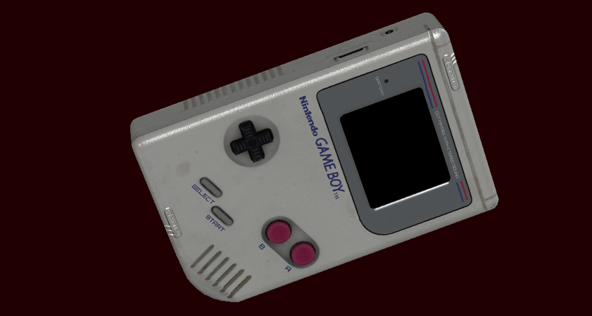

========================
TBDR Software Rasteriser
========================

Software implementation of a Tile Based Deferred Rendering (TBDR) rasteriser, with a mini graphical API and an GLTF loader. Neither clipping or texture filtering (mipmapping, bilinear, trilinear, anisotropic, etc.) has been implemented. I do not have any intention to add them so watch out for artifacts due to the lack of front-clipping when you get too close to the model. Currently it only supports an opaque (and a bit faked) PBR (physically based rendering) with a unique UV mapping for normals, ambient occlusion (AO), metallicity and rugosity and specular.

It also includes code for an IMR (immediate mode renderer) that supports blending with a single texture (no PBR). 

It uses `tinyGLTF <https://github.com/syoyo/tinygltf>`_  and `dds-ktx <https://github.com/septag/dds-ktx>`_. tinyGLTF has been modified so it loads as an include file. 

Building
--------
The CMake file is supplied. This build is for Windows only. 
I use QT Creator to build it straight from the CMake file using MinGW 64-bit compiler. Do not forget to run CMake (Build -> CMake) the first time around.

Controls
--------
Usual controls in a FPS:
- ROTATE- Left Click + Mouse movement
- W- Zoom in
- S- Zoom out
- A- Pan to left
- W- Pan to right
